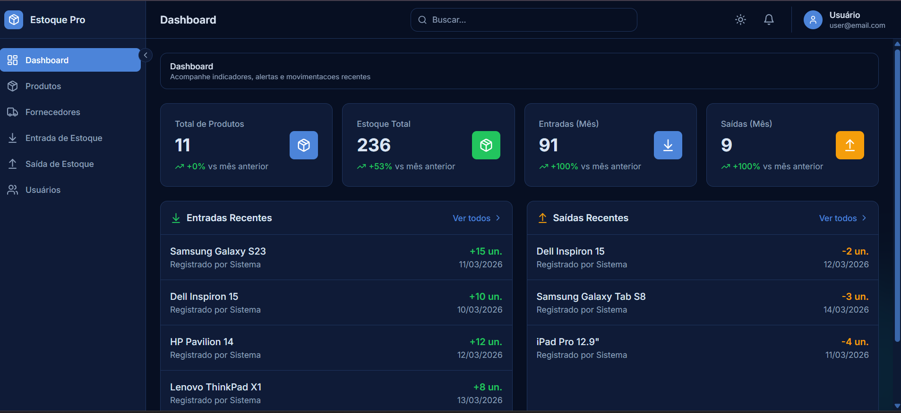
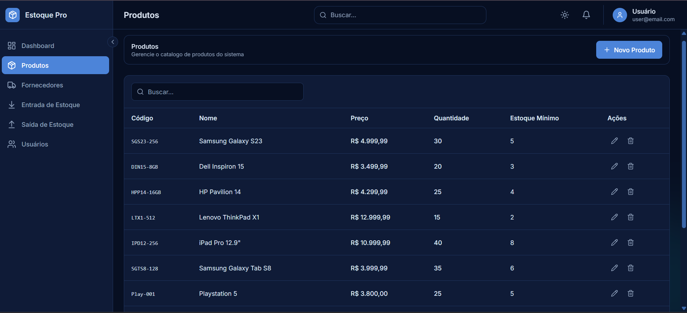
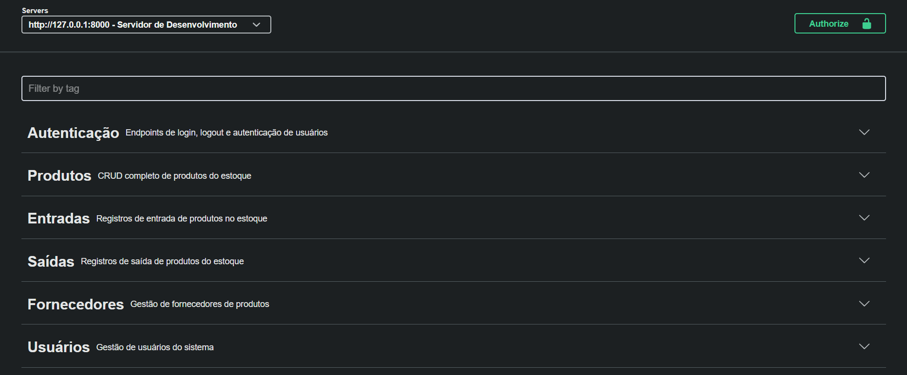
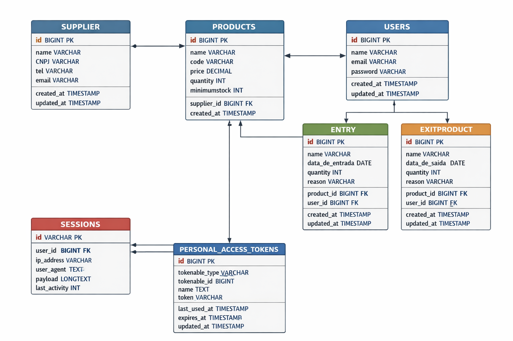

# Estoque Pro 📦

O **Estoque Pro** é uma plataforma completa de gerenciamento de inventário projetada para automatizar o controle de entradas, saídas e movimentações de produtos. O sistema utiliza uma arquitetura moderna e desacoplada para garantir escalabilidade e performance.

---

## 🚀 Tecnologias e Ferramentas

Este projeto foi desenvolvido utilizando um ecossistema robusto para desenvolvimento Full-stack:

* **Backend:** Laravel (PHP) com API RESTful.
* **Frontend:** Vue.js / React (Integração via Axios).
* **Autenticação:** JWT (JSON Web Tokens) para segurança de rotas.
* **Banco de Dados:** MySQL (Relacional).
* **Infraestrutura:** Preparado para ambientes AWS / Google Cloud.
* **DevOps:** Versionamento com GitHub e ferramentas de ambiente (XAMPP/NVM).

---

## 🛠️ Funcionalidades Principais

* **Autenticação Segura:** Sistema de login com proteção de rotas via JWT.
* **Gestão de Produtos:** CRUD completo de itens com suporte a categorias.
* **Controle de Estoque:** Monitoramento em tempo real de níveis e movimentações.
* **Dashboard de Indicadores:** Visão geral de entradas, saídas e alertas de estoque baixo.
* **Integração Total:** Comunicação fluida entre a API Backend e a Interface Frontend.

---

## 📂 Estrutura do Repositório

O projeto utiliza uma estrutura de **Monorepo** para facilitar o desenvolvimento e a manutenção:

```text
/
├── estoque-api/        # API Laravel, migrations e regras de negócio
└── frontend estoque/   # Interface e consumo da API
```

---

## 🖼️ Capturas do Projeto (Portfólio)

Adicione os arquivos de imagem no caminho `images/` na raiz do repositório usando os nomes abaixo.

### 1. Dashboard



Legenda: Visão geral do Dashboard: controle reativo de movimentações e alertas de níveis críticos.

### 2. Cadastro de Produtos



Legenda: Gestão completa de itens com validação de dados e integração fluida com a API Laravel.

### 3. Documentação da API (Swagger)



Legenda: Documentação interativa da API RESTful com Swagger, facilitando a integração e testes.

### 4. Estrutura do Banco de Dados (DER)



Legenda: Modelagem relacional no MySQL garantindo integridade e rastreabilidade total das mercadorias.
